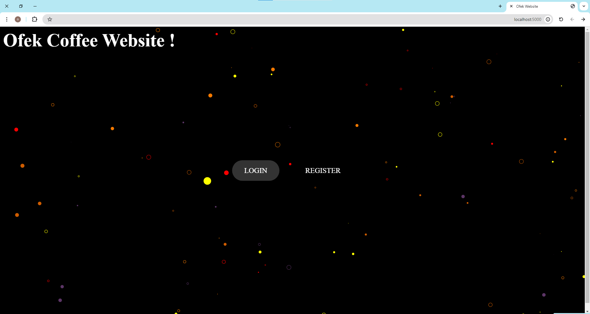
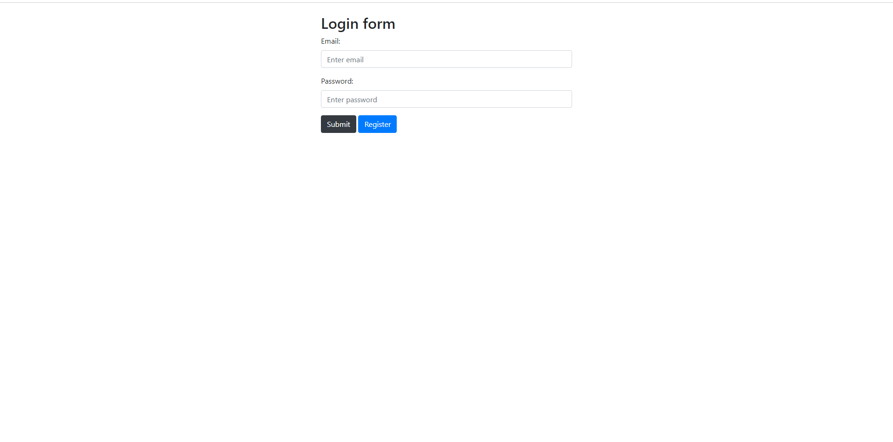
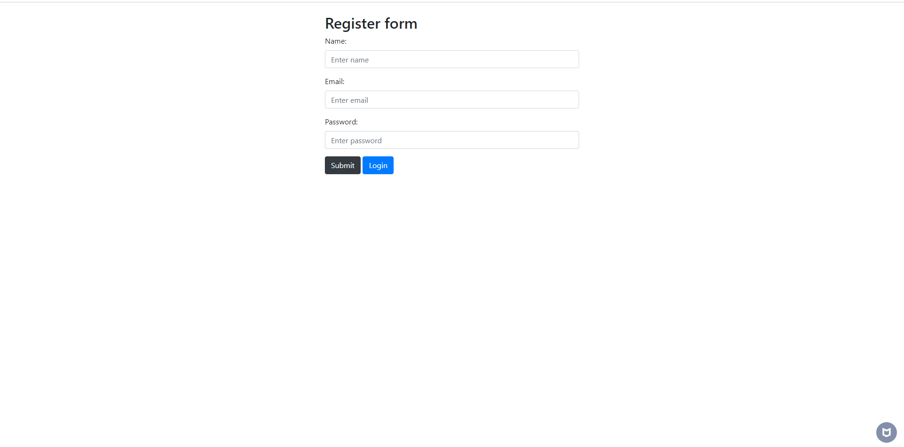
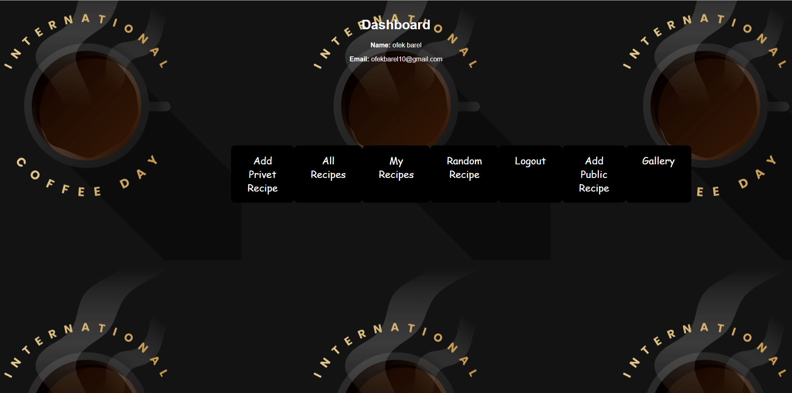
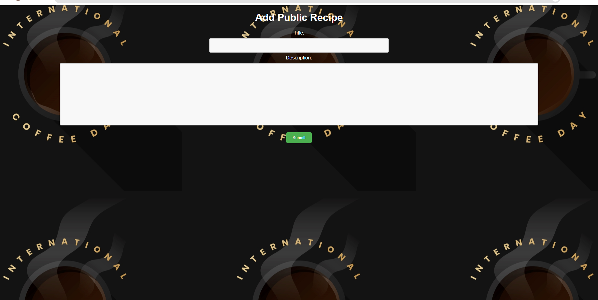
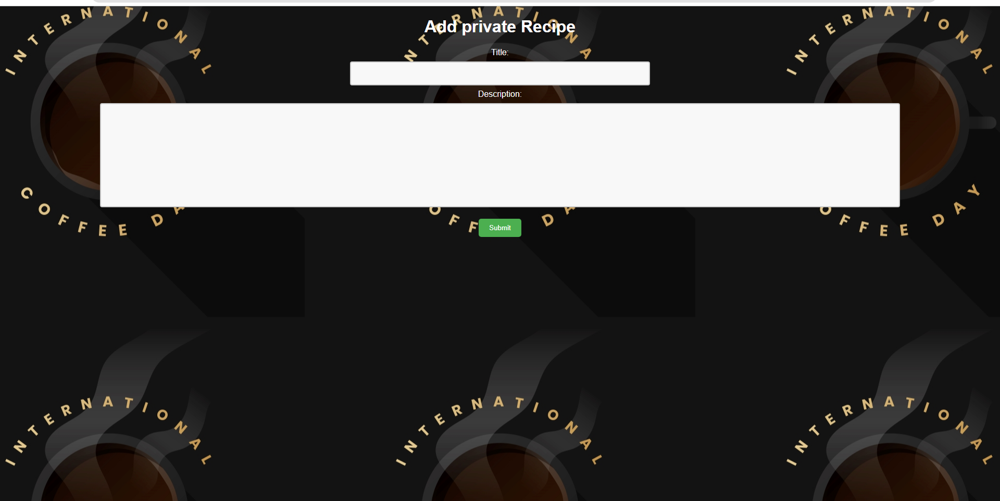
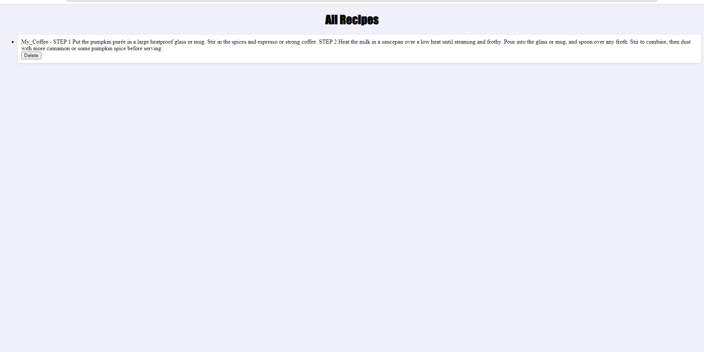
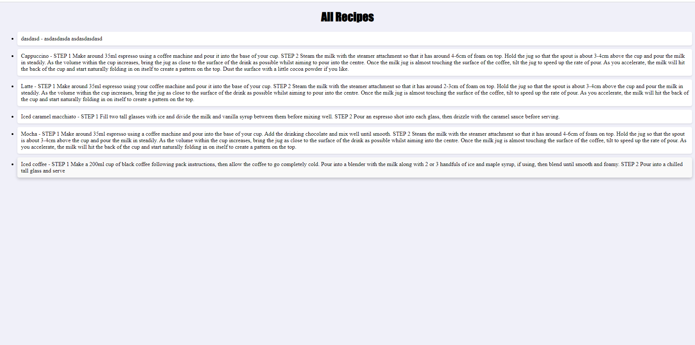
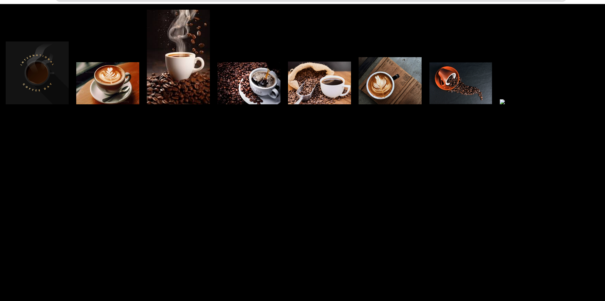

# Coffee Project # 

Welcome to my coffee recipes website, a website that contains private and public coffee recipes and other functions ! 

**index** ⚡

The first page, from here you can go to registration or login

**Login** ⚡

Guarantees secure access and entry to the user's personal area

**Register**⚡

Enables new user registration to the system

**dashboard** ⚡

The dashboard is the page with the quick access to all the other pages, contains links to all the functions of the site, only a logged in user can enter the dashboard!

**Add Public Recipe** ⚡

Allows the user to enter information about a public recipe, the information will be accessible to everyone

**Add Private Recipe** ⚡

Allows only a logged in user to enter a private recipe for him, which is associated with him in the database, using a foreign key

**My Recipes** ⚡

Displays all the private recipes of that user, according to user_id association in the database, therefore the user must be logged in

**All Recipes** ⚡

Allows access to the public recipes only, to all users even if they are not logged in

**Random Recipe** ⚡

Displays a random recipe from the public recipes in the database

**Gallery** ⚡

Shows pictures of different types of coffee

**Logout** ⚡

Disconnects the user and redirects him to the index page
