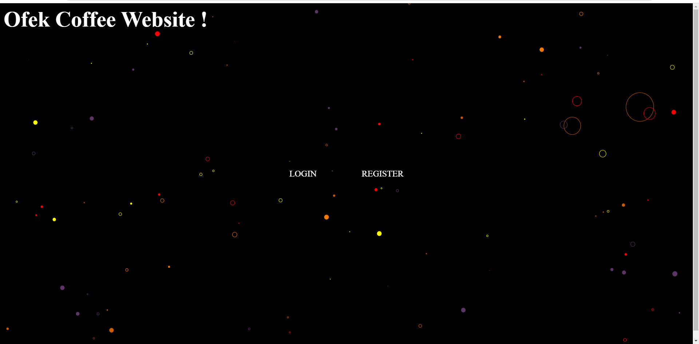

# Coffee Project # 

Welcome to my coffee recipes website, a website that contains private and public coffee recipes and other functions ! 

---

## Features ##

**index** ⚡

The first page, from here you can go to registration or login

---

**Login** ⚡

Guarantees secure access and entry to the user's personal area

---

**Register**⚡

Enables new user registration to the system

---

**dashboard** ⚡

The dashboard is the page with the quick access to all the other pages, contains links to all the functions of the site, only a logged in user can enter the dashboard!

---

**Add Public Recipe** ⚡

Allows the user to enter information about a public recipe, the information will be accessible to everyone

---

**Add Private Recipe** ⚡

Allows only a logged in user to enter a private recipe for him, which is associated with him in the database, using a foreign key

---

**My Recipes** ⚡

Displays all the private recipes of that user, according to user_id association in the database, therefore the user must be logged in

---

**All Recipes** ⚡

Allows access to the public recipes only, to all users even if they are not logged in

---

**Random Recipe** ⚡

Displays a random recipe from the public recipes in the database

---

**Gallery** ⚡

Shows pictures of different types of coffee

---
**Logout** ⚡

Disconnects the user and redirects him to the index page

---

## tools 💼

In our project we use modern technologies and tools to improve and optimize the development, testing and deployment process.
In this project we use these tools especially and especially in the various devops processes.

- ****Continuous Integration and Delivery****
  

